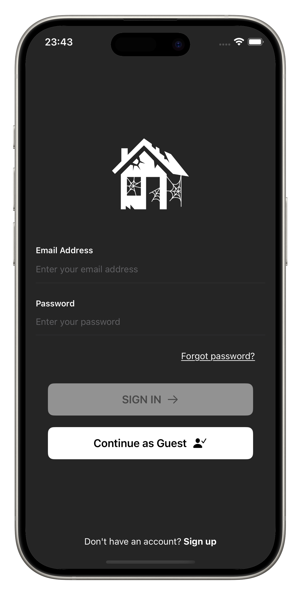
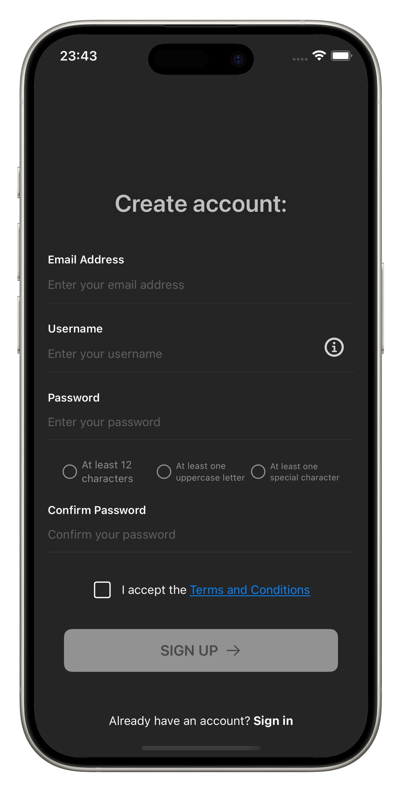
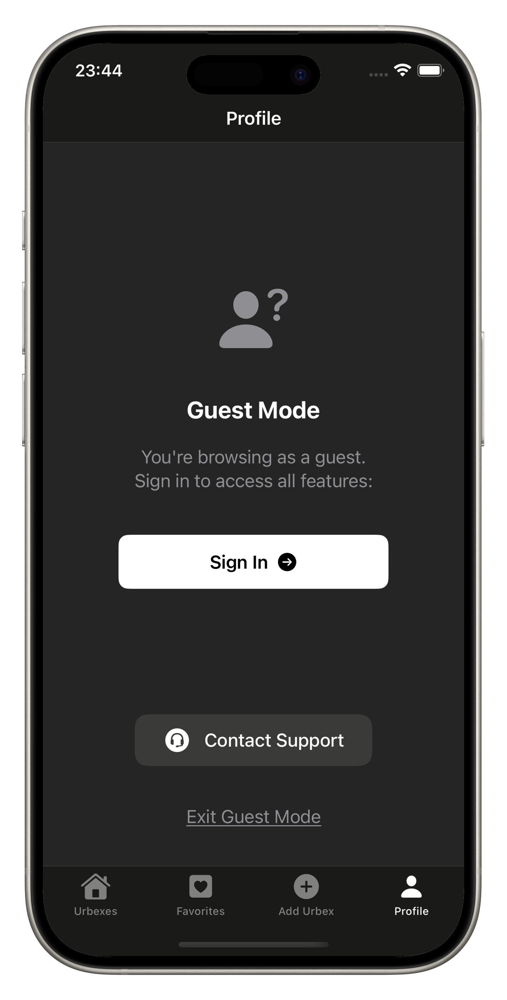
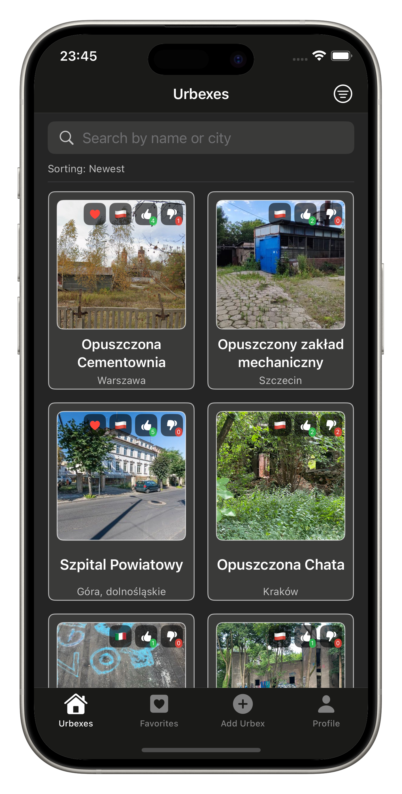
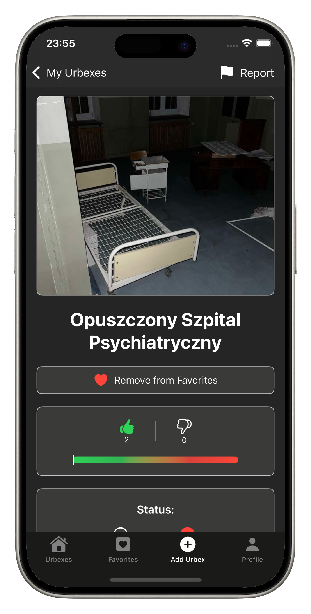
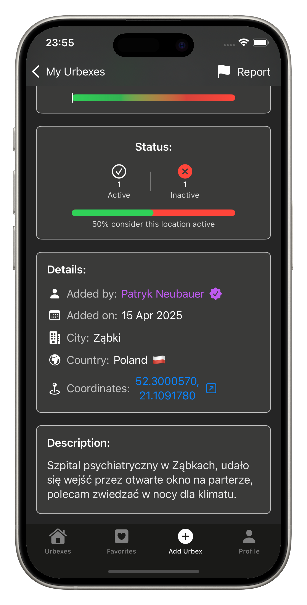
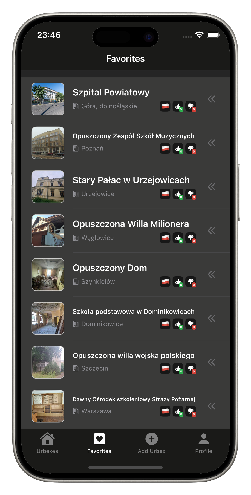
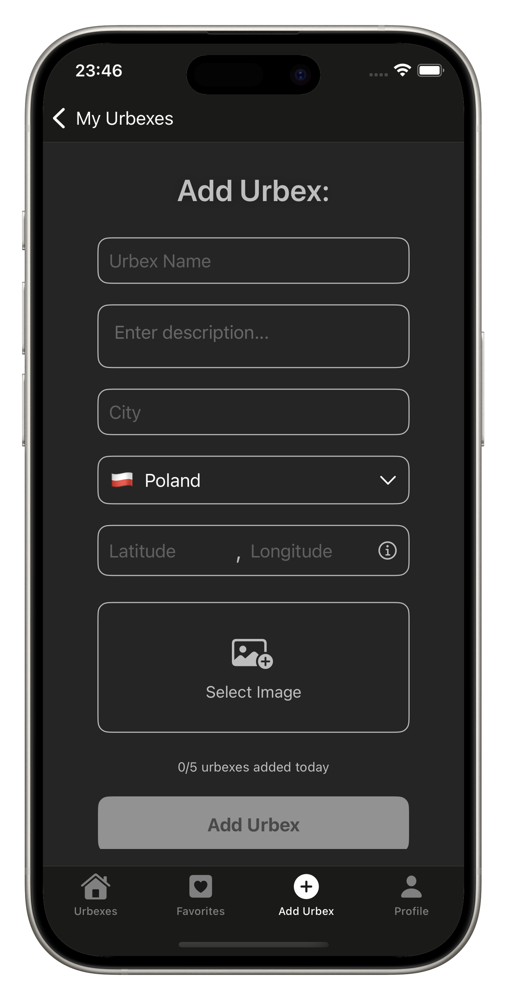
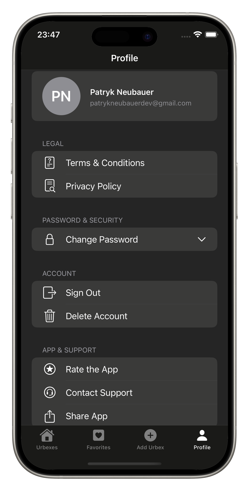

<h1 align="left"> Eksplorator</h1>

> **Urbex discovery app for iOS** — find, share, and explore abandoned places around the world. Built entirely in Swift, powered by Firebase, and protected by AI-driven content moderation.

  

> 🏆 **Eksplorator is my first and biggest project — and I'm proud to say it's live on the App Store.** Shipping a UGC (user-generated content) app comes with real challenges around moderation, safety, and trust, and this app tackles all of them head-on.

---

## About

Eksplorator is a community-driven platform for urban explorers — people who seek out abandoned buildings, forgotten factories, derelict hospitals, and hidden ruins. Users can browse a map of urbex locations submitted by the community, view details and coordinates, save favourites, and contribute their own finds.

Because it's a **UGC app**, content safety was a first-class concern from day one. Every piece of text and every photo submitted goes through multiple layers of AI moderation before it ever appears to other users.

---

## Features at a glance

- 🔐 **Auth with Guest Mode** — full account system with email/password, password recovery via Firebase, and a guest mode for App Store compliance
- 🏚️ **Browse urbex locations** — sortable grid of community-submitted locations with like/dislike counts and active/inactive status
- 📍 **Detailed location view** — full-size photo, coordinates with a Google Maps deep-link, added-by info, country & city, and description
- ❤️ **Favourites** — save locations and manage them with a swipe-to-remove gesture
- ➕ **Add your own urbex** — submit a name, description, city, country, GPS coordinates, and photo (capped at 5 submissions per device per day)
- 🛡️ **AI content moderation** — OpenAI for text, Google Vision API for images — nothing slips through unreviewed
- 🚩 **Report system** — users can flag inappropriate locations directly from the detail screen
- 👤 **Profile tab** — account management, password change, Terms & Conditions, Privacy Policy, app rating, support contact, and account deletion

---

## Authentication & account system

The login and registration flow was built to meet App Store review requirements while keeping the experience smooth for real users.

**Guest mode** lets anyone browse the app without creating an account — but with deliberate restrictions: guests cannot add urbex locations or save favourites. The limitation nudges users toward registration without forcing it.

**Registration** enforces strict validation:
- Username is checked against a keyword blocklist **and** screened by AI for inappropriate content
- Email must match a valid structural format
- Password requires a minimum of **12 characters**, at least one uppercase letter, and one special character
- Users must accept **Terms & Conditions** before proceeding

**Password recovery** works via Firebase's email reset flow — users get a reset link sent to their registered address.

---

## Content moderation

Keeping a UGC app clean is hard. Eksplorator uses a multi-layer approach:

| Layer | What it checks |
|---|---|
| **Keyword filter** | Username and urbex text screened against a custom blocklist |
| **OpenAI API** | Catches nuanced or creative attempts to sneak in inappropriate text |
| **Google Vision API** | Scans every uploaded photo for explicit or violent content before it's published |
| **Manual review** | All submissions are also visible to me via Firebase Console for a final human check |
| **Report system** | In-app flagging lets the community help surface anything that slips through |

---

## Screenshots

### 🔐 Authentication

&nbsp;&nbsp;&nbsp;&nbsp;&nbsp;&nbsp;&nbsp;&nbsp;&nbsp;&nbsp;&nbsp;&nbsp;&nbsp;&nbsp;&nbsp;&nbsp;

| Login screen | Create account | Guest mode |
|:-:|:-:|:-:|
| Clean sign-in with email & password, password recovery link, and guest mode entry | Full registration with username validation, strict password rules, and T&C acceptance | Browsing as a guest — view-only access, no account required |

---

### 🏚️ Browsing & location details

&nbsp;&nbsp;&nbsp;&nbsp;&nbsp;&nbsp;&nbsp;&nbsp;&nbsp;&nbsp;&nbsp;&nbsp;&nbsp;&nbsp;&nbsp;&nbsp;

| Urbexes tab | Location detail | More details |
|:-:|:-:|:-:|
| Sortable grid of all locations — filter by most liked, least liked, or newest | Full-size photo, like/dislike counts, active status, added-by info, country & city | Description, GPS coordinates with a Google Maps deep-link, and report button |

---

### ❤️ Favourites, adding a location & profile

&nbsp;&nbsp;&nbsp;&nbsp;&nbsp;&nbsp;&nbsp;&nbsp;&nbsp;&nbsp;&nbsp;&nbsp;&nbsp;&nbsp;&nbsp;&nbsp;

| Favourites | Add urbex | Profile |
|:-:|:-:|:-:|
| Saved locations at a glance — swipe left to remove from favourites | Submit a new location: name, description, city, country, coordinates, and photo (5/day per device) | Account info, legal docs, password change, app rating, support, and account deletion |

---

## Tech stack

| Technology | Role |
|---|---|
| **Swift** | Entire codebase — no Objective-C, no bridges |
| **SwiftUI** | Declarative UI with native animations and gestures |
| **Firebase Auth** | Email/password authentication, guest mode, password reset via email |
| **Firebase Firestore** | Real-time NoSQL database for all urbex location data |
| **Firebase Storage** | Cloud storage for user-uploaded photos |
| **OpenAI API** | AI text moderation for usernames, descriptions, and location names |
| **Google Vision API** | AI image moderation — scans every uploaded photo for explicit content |
| **Google Maps deep-link** | Coordinates tap through directly to Google Maps for navigation |
| **URLSession + async/await** | Native HTTP networking — no third-party SDKs |

---

## Download the app

Eksplorator is available on the **App Store** — just search for **Eksplorator** or tap the badge at the top of this page. No setup, no API keys, no Xcode. Just download and start exploring. 🏚️

---

## Contact

✉️ [patrykneubauerdev@gmail.com](mailto:patrykneubauerdev@gmail.com)

---

*Thanks for stopping by! 👋*
